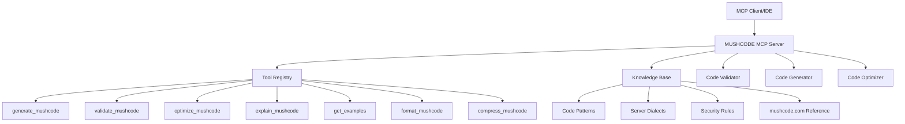

# Design Document

## Overview

The MUSHCODE MCP Server is a specialized Model Context Protocol server that provides AI-powered assistance for MUSHCODE development. The server implements multiple tools for code generation, validation, optimization, and education, leveraging comprehensive knowledge of MUSHCODE syntax, patterns, and best practices from resources like mushcode.com.

The server follows the standard MCP architecture pattern, exposing tools through JSON-RPC 2.0 protocol that can be consumed by any MCP-compatible client (IDEs, editors, etc.). It maintains a knowledge base of MUSHCODE patterns, server-specific dialects, and security best practices to provide contextually appropriate assistance.

## Architecture

### High-Level Architecture



### Core Components

1. **MCP Server Framework**: Handles protocol communication, tool registration, and request routing
2. **Knowledge Base**: Stores MUSHCODE patterns, syntax rules, and server-specific information
3. **Code Generator**: Creates new MUSHCODE based on specifications and requirements
4. **Code Validator**: Analyzes existing code for syntax errors and security issues
5. **Code Optimizer**: Suggests improvements for performance and maintainability
6. **Code Formatter**: Pretty-prints MUSHCODE for readability and consistency
7. **Code Compressor**: Minifies MUSHCODE for deployment and size optimization
8. **Educational Module**: Provides explanations, examples, and learning resources

## Components and Interfaces

### MCP Server Interface

The server implements the standard MCP protocol with the following capabilities:

```typescript
interface MCPCapabilities {
  tools: {
    listChanged?: boolean;
  };
  resources?: {
    subscribe?: boolean;
    listChanged?: boolean;
  };
}
```

### Tool Definitions

#### 1. generate_mushcode Tool

```typescript
interface GenerateMushcodeArgs {
  description: string;           // What the code should do
  server_type?: string;         // Target MUD server (PennMUSH, TinyMUSH, etc.)
  function_type?: string;       // Type of function (command, function, trigger)
  parameters?: string[];        // Expected parameters
  security_level?: string;      // Required permission level
  include_comments?: boolean;   // Whether to include explanatory comments
}

interface GenerateMushcodeResult {
  code: string;                 // Generated MUSHCODE
  explanation: string;          // How the code works
  usage_example: string;        // Example of how to use the code
  compatibility: string[];      // Compatible server types
  security_notes?: string;      // Security considerations
}
```

#### 2. validate_mushcode Tool

```typescript
interface ValidateMushcodeArgs {
  code: string;                 // MUSHCODE to validate
  server_type?: string;         // Target server for validation
  strict_mode?: boolean;        // Enable strict validation rules
}

interface ValidateMushcodeResult {
  is_valid: boolean;           // Overall validation result
  syntax_errors: SyntaxError[]; // Syntax issues found
  security_warnings: SecurityWarning[]; // Security concerns
  best_practice_suggestions: Suggestion[]; // Improvement suggestions
  compatibility_notes: string[]; // Server compatibility notes
}
```

#### 3. optimize_mushcode Tool

```typescript
interface OptimizeMushcodeArgs {
  code: string;                 // Code to optimize
  optimization_goals?: string[]; // Performance, readability, security
  server_type?: string;         // Target server type
  preserve_functionality?: boolean; // Ensure no behavior changes
}

interface OptimizeMushcodeResult {
  optimized_code: string;       // Improved code
  improvements: Improvement[];   // List of changes made
  performance_impact: string;   // Expected performance benefits
  explanation: string;          // Why optimizations were made
}
```

#### 4. explain_mushcode Tool

```typescript
interface ExplainMushcodeArgs {
  code: string;                 // Code to explain
  detail_level?: string;        // basic, intermediate, advanced
  focus_areas?: string[];       // Specific aspects to explain
}

interface ExplainMushcodeResult {
  explanation: string;          // Detailed explanation
  code_breakdown: CodeSection[]; // Line-by-line analysis
  concepts_used: string[];      // MUSHCODE concepts demonstrated
  related_examples: string[];   // Links to similar examples
}
```

#### 5. get_examples Tool

```typescript
interface GetExamplesArgs {
  topic: string;                // What examples to retrieve
  difficulty?: string;          // beginner, intermediate, advanced
  server_type?: string;         // Target server type
  category?: string;            // commands, functions, triggers, etc.
}

interface GetExamplesResult {
  examples: CodeExample[];      // Array of relevant examples
  learning_path?: string[];     // Suggested progression
  additional_resources: string[]; // Links to mushcode.com and other resources
}
```

#### 6. format_mushcode Tool

```typescript
interface FormatMushcodeArgs {
  code: string;                 // Code to format
  style?: string;               // formatting style (readable, compact, custom)
  indent_size?: number;         // Number of spaces for indentation
  line_length?: number;         // Maximum line length before wrapping
  preserve_comments?: boolean;  // Whether to keep existing comments
  server_type?: string;         // Target server for dialect-specific formatting
}

interface FormatMushcodeResult {
  formatted_code: string;       // Pretty-formatted code
  changes_made: string[];       // List of formatting changes applied
  style_notes: string;          // Explanation of formatting choices
}
```

#### 7. compress_mushcode Tool

```typescript
interface CompressMushcodeArgs {
  code: string;                 // Code to compress
  compression_level?: string;   // minimal, moderate, aggressive
  preserve_functionality?: boolean; // Ensure no behavior changes
  remove_comments?: boolean;    // Strip comments for size reduction
  server_type?: string;         // Target server for optimization
}

interface CompressMushcodeResult {
  compressed_code: string;      // Compressed/minified code
  original_size: number;        // Original character count
  compressed_size: number;      // Compressed character count
  compression_ratio: number;    // Percentage reduction
  optimizations_applied: string[]; // List of compression techniques used
  warnings?: string[];          // Any potential issues with compression
}
```

## Data Models

### Knowledge Base Schema

```typescript
interface MushcodePattern {
  id: string;
  name: string;
  description: string;
  code_template: string;
  parameters: Parameter[];
  server_compatibility: string[];
  security_level: string;
  examples: string[];
  related_patterns: string[];
}

interface ServerDialect {
  name: string;
  version: string;
  syntax_variations: SyntaxRule[];
  unique_features: Feature[];
  security_model: SecurityModel;
  function_library: FunctionDefinition[];
}

interface SecurityRule {
  rule_id: string;
  description: string;
  severity: 'low' | 'medium' | 'high' | 'critical';
  pattern: string;              // Regex pattern to match
  recommendation: string;
  examples: {
    bad: string;
    good: string;
  };
}
```

### Code Analysis Models

```typescript
interface SyntaxError {
  line: number;
  column: number;
  message: string;
  severity: 'error' | 'warning';
  suggestion?: string;
}

interface SecurityWarning {
  type: string;
  description: string;
  line_number?: number;
  severity: 'low' | 'medium' | 'high' | 'critical';
  mitigation: string;
}

interface Improvement {
  type: 'performance' | 'readability' | 'security' | 'best_practice';
  description: string;
  before: string;
  after: string;
  impact: string;
}
```

## Error Handling

### Error Categories

1. **Protocol Errors**: MCP communication issues
2. **Validation Errors**: Invalid input parameters
3. **Generation Errors**: Unable to generate requested code
4. **Knowledge Base Errors**: Missing or corrupted reference data

### Error Response Format

```typescript
interface ErrorResponse {
  error: {
    code: number;
    message: string;
    data?: {
      details: string;
      suggestions?: string[];
      documentation_link?: string;
    };
  };
}
```

### Error Handling Strategy

- Graceful degradation when knowledge base is incomplete
- Fallback to generic MUSHCODE patterns when server-specific information is unavailable
- Clear error messages with actionable suggestions
- Logging for debugging and improvement purposes

## Testing Strategy

### Unit Testing

- **Tool Functions**: Test each MCP tool with various input scenarios
- **Code Generation**: Verify generated code syntax and functionality
- **Validation Logic**: Test detection of syntax errors and security issues
- **Optimization Engine**: Ensure optimizations maintain functionality
- **Formatting Engine**: Test code formatting consistency and readability
- **Compression Engine**: Verify compression maintains functionality while reducing size
- **Knowledge Base**: Validate pattern matching and retrieval

### Integration Testing

- **MCP Protocol**: Test full request/response cycles
- **Server Compatibility**: Verify dialect-specific code generation
- **Error Scenarios**: Test error handling and recovery
- **Performance**: Measure response times for different operations

### Test Data

- Sample MUSHCODE from different server types
- Known good and bad code patterns
- Security vulnerability examples
- Performance optimization test cases
- Educational examples from mushcode.com

### Testing Tools

- Jest for unit testing
- Custom MCP client for integration testing
- MUSHCODE syntax validators for verification
- Performance benchmarking tools
- Security scanning utilities

### Continuous Testing

- Automated testing on code changes
- Regular validation against mushcode.com updates
- Performance regression testing
- Security vulnerability scanning
- User feedback integration testing

## Implementation Notes

### Knowledge Base Population

The server will be initialized with comprehensive MUSHCODE knowledge including:

- Core syntax and functions from mushcode.com
- Server-specific dialect information (PennMUSH, TinyMUSH, RhostMUSH, etc.)
- Common code patterns and idioms
- Security best practices and vulnerability patterns
- Performance optimization techniques

### Extensibility

The design supports future enhancements:

- Additional server dialect support
- Custom pattern libraries
- User-specific code templates
- Integration with MUD development tools
- Community-contributed examples and patterns

### Performance Considerations

- Efficient pattern matching algorithms
- Caching of frequently requested examples
- Lazy loading of server-specific knowledge
- Optimized code generation templates
- Response time monitoring and optimization